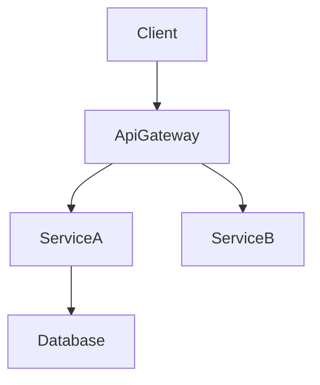

# 技術設計ルールと原則

## コア設計原則

### 1. 型安全は必須
- TypeScriptインターフェースで `any` 型を**絶対に使わない**
- すべてのパラメータと戻り値に明示的な型を定義
- エラーハンドリングにはDiscriminated Unionを使用
- ジェネリック制約を明確に指定

### 2. 設計 vs 実装
- **HOWではなくWHATに焦点**
- コードではなく、インターフェースとコントラクトを定義
- 事前/事後条件で振る舞いを指定
- アルゴリズムではなく、アーキテクチャ決定を文書化

### 3. ビジュアルコミュニケーション
- **シンプルな機能**: 基本的なコンポーネント図またはなし
- **中程度の複雑さ**: アーキテクチャ + データフロー
- **高い複雑さ**: 複数の図（アーキテクチャ、シーケンス、状態）
- **常に純粋なMermaid**: スタイリングなし、構造のみ

### 4. コンポーネント設計ルール
- **単一責任**: コンポーネントごとに1つの明確な目的
- **明確な境界**: 明示的なドメイン所有権
- **依存方向**: アーキテクチャレイヤーに従う
- **インターフェース分離**: 最小限で焦点を絞ったインターフェース
- **チーム安全なインターフェース**: マージ競合なしに並列実装を可能にする境界設計
- **調査トレーサビリティ**: 境界決定とその根拠を `research.md` に記録

### 5. データモデリング標準
- **ドメインファースト**: ビジネス概念から開始
- **整合性境界**: 明確な集約ルート
- **正規化**: パフォーマンスと整合性のバランス
- **進化**: スキーマ変更を計画

### 6. エラーハンドリング哲学
- **フェイルファスト**: 早期に明確に検証
- **グレースフルデグラデーション**: 完全な失敗より部分的な機能
- **ユーザーコンテキスト**: アクション可能なエラーメッセージ
- **オブザーバビリティ**: 包括的なロギングとモニタリング

### 7. 統合パターン
- **疎結合**: 依存を最小化
- **コントラクトファースト**: 実装前にインターフェースを定義
- **バージョニング**: API進化を計画
- **べき等性**: リトライ安全に設計
- **コントラクト可視性**: APIとイベントコントラクトを design.md に表示し、`research.md` からの詳細にリンク

## ドキュメント標準

### 言語とトーン
- **宣言的**: 「システムはユーザーを認証する」であり「システムはユーザーを認証すべき」ではない
- **正確**: 曖昧な説明より具体的な技術用語
- **簡潔**: 本質的な情報のみ
- **フォーマル**: プロフェッショナルな技術文書

### 構造要件
- **階層的**: 明確なセクション構成
- **トレーサブル**: 要件からコンポーネントへのマッピング
- **完全**: 実装に必要なすべての側面をカバー
- **一貫性**: 全体で統一された用語
- **焦点を絞る**: design.md はアーキテクチャとコントラクトに集中。調査ログや長い比較は `research.md` に移動

## セクション作成ガイダンス

### 全体の順序
- デフォルトフロー: 概要 → 目標/非目標 → 要件トレーサビリティ → アーキテクチャ → 技術スタック → システムフロー → コンポーネント & インターフェース → データモデル → オプションセクション
- チームはトレーサビリティを前に移動したり、データモデルをアーキテクチャの近くに配置したりして明確さを改善できるが、セクション見出しは維持する
- 各セクション内で **サマリー → スコープ → 決定 → 影響/リスク** の順序に従い、レビュアーが一貫してスキャンできるようにする

### 要件ID
- 要件は `2.1, 2.3` のようにプレフィックスなしで参照（「Requirement 2.1」ではない）
- すべての要件には数値IDが必要。要件に数値IDがない場合、続行前に `requirements.md` を修正する
- `N.M` 形式の数値IDを使用。`N` は requirements.md のトップレベル要件番号（例: Requirement 1 → 1.1, 1.2; Requirement 2 → 2.1, 2.2）
- すべてのコンポーネント、タスク、トレーサビリティ行で同じ正規の数値IDを参照

### 技術スタック
- この機能に影響を受けるレイヤーのみを含める（フロントエンド、バックエンド、データ、メッセージング、インフラ）
- 各レイヤーでツール/ライブラリ + バージョン + 役割を指定。詳細な根拠、比較、ベンチマークは `research.md` に
- 既存システムを拡張する場合、現在のスタックからの逸脱を強調し、新しい依存関係をリスト

### システムフロー
- 振る舞いを明確にする場合のみ図を追加:
  - **シーケンス**: マルチステップのインタラクション
  - **プロセス/状態**: 分岐ルールまたはライフサイクル
  - **データ/イベント**: パイプラインまたは非同期パターン
- 常に純粋なMermaidを使用。複雑なフローがない場合、セクション全体を省略

### 要件トレーサビリティ
- 標準テーブル（`Requirement | Summary | Components | Interfaces | Flows`）を使用してカバレッジを証明
- 単一の要件が1:1でコンポーネントにマップされる場合のみ、箇条書き形式に簡略化
- シンプルなマッピングにはコンポーネントサマリーテーブルを優先。複雑またはコンプライアンス重視の要件には完全なトレーサビリティテーブルを使用
- 要件やコンポーネントが変更されるたびにこのマッピングを再実行してドリフトを防ぐ

### コンポーネント & インターフェース作成
- コンポーネントをドメイン/レイヤーでグループ化し、コンポーネントごとに1ブロックを提供
- コンポーネント、ドメイン、意図、要件カバレッジ、主要な依存関係、選択されたコントラクトをリストするサマリーテーブルから始める
- テーブルフィールド: Intent（1行）、Requirements（`2.1, 2.3`）、Owner/Reviewers（オプション）
- 依存関係テーブルは各エントリを Inbound/Outbound/External としてマークし、Criticality（`P0` ブロッキング、`P1` 高リスク、`P2` 情報提供）を割り当てる
- 外部依存関係調査のサマリーはここに。詳細な調査（APIシグネチャ、レート制限、移行ノート）は `research.md` に
- design.md は自己完結したレビュアー向け成果物でなければならない。`research.md` は背景としてのみ参照し、結論や決定はここに記載
- コントラクト: 関連するタイプのみをチェック（Service/API/Event/Batch/State）。チェックされていないタイプは後のコンポーネントセクションに表示しない
- サービスインターフェースはメソッドシグネチャ、入出力、エラーエンベロープを宣言。API/Event/Batchコントラクトはトリガー、ペイロード、配信、べき等性をカバーするスキーマテーブルまたは箇条書きが必要
- **統合 & 移行ノート**、**バリデーションフック**、**オープンクエスチョン / リスク** を使用してロールアウト戦略、オブザーバビリティ、未解決の決定を文書化
- 詳細密度ルール:
  - **フルブロック**: 新しい境界を導入するコンポーネント（ロジックフック、共有サービス、外部統合、データレイヤー）
  - **サマリーのみ**: 新しい境界のないプレゼンテーショナル/UIコンポーネント（必要に応じて短い実装ノート付き）
- 実装ノートは統合 / バリデーション / リスクを単一の箇条書きサブセクションに統合して重複を減らす
- 短いデータ（依存関係、コントラクト選択）にはリストまたはインライン記述子を優先。テーブルは複数項目を比較する場合のみ使用

### 共有インターフェース & Props
- 繰り返しのUIコンポーネント用にベースインターフェース（例: `BaseUIPanelProps`）を定義し、差分のみをキャプチャするためにコンポーネントごとに拡張
- 新しいコントラクトを導入するフック、ユーティリティ、統合アダプターには完全なTypeScriptシグネチャを含める
- ベースコントラクトを再利用する場合、コードブロックを複製する代わりに明示的に参照（例: 「`BaseUIPanelProps` を `onSubmitAnswer` コールバックで拡張」）

### データモデル
- ドメインモデルは集約、エンティティ、値オブジェクト、ドメインイベント、不変条件をカバー。関係が非自明な場合のみMermaid図を追加
- 論理データモデルは構造、インデックス、シャーディング、変更に関連するストレージ固有の考慮事項（イベントストア、KV/ワイドカラム）を明確にする
- データコントラクト & 統合セクションは、機能が境界を越える場合のAPIペイロード、イベントスキーマ、クロスサービス同期パターンを文書化
- 長い型定義やベンダー固有のオプションオブジェクトは design.md 内の補足参照セクションに配置し、関連セクションからリンク。調査ノートは `research.md` に
- 補足参照の使用はオプション。メインボディにコンテンツを残すと可読性が低下する場合のみ作成。すべての決定はメインセクションに表示し、design.md が単独で成立するようにする

### エラー/テスト/セキュリティ/パフォーマンスセクション
- 機能固有の決定や逸脱のみを記録。ベースラインプラクティスについては組織全体の標準（ステアリング）にリンクまたは参照

### 図とテキストの重複排除
- 図の内容を文章で逐語的に繰り返さない。テキストは、ビジュアルから明らかでない主要な決定、トレードオフ、影響を強調するために使用
- 決定が図の注釈で完全にキャプチャされている場合、短い「主要な決定」箇条書きで十分

### 一般的な重複排除
- 概要、アーキテクチャ、コンポーネント間で同じ情報を繰り返さない。コンテキストが同じ場合は以前のセクションを参照
- 要件/コンポーネントの関係がサマリーテーブルでキャプチャされている場合、追加のニュアンスがない限り他で書き直さない

## 図ガイドライン

### 図を含めるタイミング
- **アーキテクチャ**: 3つ以上のコンポーネントまたは外部システムが相互作用する場合に構造図を使用
- **シーケンス**: コール/ハンドシェイクが複数ステップにまたがる場合にシーケンス図を描く
- **状態 / フロー**: 複雑な状態マシンまたはビジネスフローを専用の図でキャプチャ
- **ER**: 非自明なデータモデルにエンティティ関係図を提供
- **スキップ**: 軽微な単一コンポーネントの変更には通常図は不要

### Mermaid要件

- **純粋なMermaidのみ** – カスタムスタイリングやサポートされていない構文を避ける
- **ノードID** – 英数字とアンダースコアのみ（例: `Client`, `ServiceA`）。`@`, `/`, または先頭の `-` は使用しない
- **ラベル** – シンプルな単語。括弧 `()`, 角括弧 `[]`, 引用符 `"`, スラッシュ `/` を埋め込まない
  - ❌ `DnD[@dnd-kit/core]` → 無効なID（`@`）
  - ❌ `UI[KanbanBoard(React)]` → 無効なラベル（`()`）
  - ✅ `DndKit[dnd-kit core]` → ラベルにはプレーンテキストを使用し、技術詳細は付随する説明に記載
  - ℹ️ Mermaid strict-mode は `Expecting 'SQE' ... got 'PS'` のようなエラーで失敗する。レンダリング前にラベルから句読点を削除
- **エッジ** – データまたは制御フローの方向を示す
- **グループ** – Mermaid subgraph を使用して関連コンポーネントをクラスタリングすることは許可。明確さのために控えめに使用

## 品質メトリクス
### 設計完全性チェックリスト
- すべての要件に対応
- 実装詳細の漏れなし
- 明確なコンポーネント境界
- 明示的なエラーハンドリング
- 包括的なテスト戦略
- セキュリティを考慮
- パフォーマンス目標を定義
- 移行パスが明確（該当する場合）

### 避けるべき一般的なアンチパターン
❌ 設計と実装の混在
❌ 曖昧なインターフェース定義
❌ 欠落したエラーシナリオ
❌ 無視された非機能要件
❌ 過度に複雑なアーキテクチャ
❌ コンポーネント間の密結合
❌ データ整合性戦略の欠如
❌ 不完全な依存関係分析
