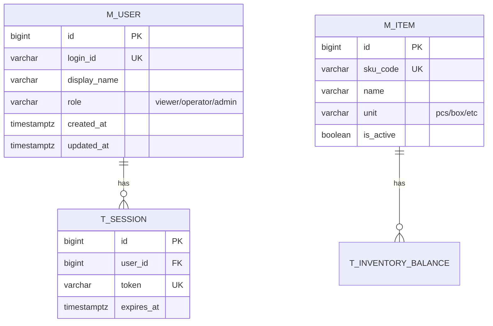

# データモデル / ERD（{{PROJECT_NAME}}）

**目的**: 実装/レビュー/運用が同じ参照を見られるように、ドメイン境界とテーブル関係を Mermaid で固定する。
**作成/更新タイミング**: `/design` の前半（MVPの主要エンティティが見えたら）。詳細は `.cursor/templates/artifacts/artifacts_rules.md`。

---

## ER 図

**記載ルール（必須）**
- `erDiagram` 内で、関係線だけでなく **各テーブルのカラム定義ブロック**（PK/UK/FK）も記載する。
- PK/UK/FK は分かる範囲で明示する（最低限 `id PK`、主要UK、参照カラムの `FK`）。
- `%%` は Mermaid のコメントとして使用してよい。

---

## テーブル間の関係性

### 外部キー制約一覧

| FK 制約名 | 参照元テーブル | 参照元カラム | 参照先テーブル | 参照先カラム | ON DELETE | ON UPDATE | 説明 |
| -------- | -------------- | ------------ | -------------- | ------------ | -------- | -------- | ---- |
| (例) fk_xxx | t_xxx | yyy_id | m_yyy | id | RESTRICT | CASCADE | |

### テーブル間の依存関係

- **依存関係の要約**:
  - （例）`m_user → t_session`: 1対多。ユーザーが無効なら新規セッション発行停止

### データ整合性ルール

- **整合性方針（例）**:
  1. どのテーブルが“正（source of truth）”か
  2. 更新禁止/追記のみ（監査性）
  3. 冪等性（例: request_id UNIQUE）
  4. 論理削除/無効化方針
  5. 参照整合性（ON DELETE 方針）

---

## 参照
- **テーブル定義書**: `table-definition.md`
- **機能一覧**: `feature-list.md`

---

## 変更履歴

| 日付 | バージョン | 変更者 | 変更内容 |
| ---- | ---------- | ------ | -------- |
| {{DATE}} | v1.0 | {{AUTHOR}} | 初版作成 |
